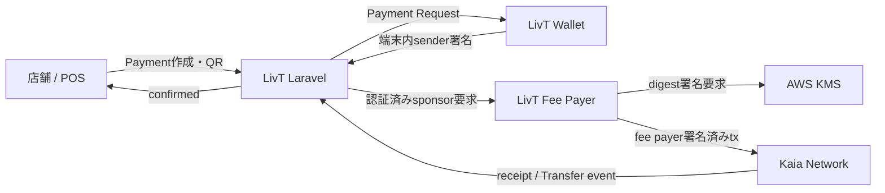

# LivT

LivTは、店舗がJPYCでQR決済を受け付けるための決済プラットフォームです。Laravelを決済の正本として、Paymentの作成、期限、支払条件、ブロックチェーン上の証拠、Fee Delegationの監査状態を管理します。

このリポジトリはバックエンドと店舗向けWeb画面を担当します。利用者の秘密鍵は保持せず、署名はMetaMaskまたは別リポジトリのLivT Wallet、ガス代の代理負担はLivT Fee Payerが担当します。

## LivTとは

LivTが目指すのは、店舗が日本円建てステーブルコインJPYCを扱える、理解しやすく検証可能な決済基盤です。

- 店舗スタッフがPOS画面からPaymentを作成
- 支払い条件をQRまたはURLで利用者へ提示
- 利用者が自分のWalletで署名
- LaravelがreceiptとERC-20 `Transfer` eventを独立検証
- 検証に成功したPaymentだけを`confirmed`に更新
- Fee Delegation利用時も同じ最終検証を適用

tx hashだけを支払い証明として信用せず、Payment作成時の不変snapshotとchain上の事実を照合します。

## Mainnet実証

2026年9月17日、Kaia Mainnetでself-hosted Fee Payerを利用した1 JPYCの決済に成功しました。

| 項目 | 結果 |
|---|---|
| Network | Kaia Mainnet |
| Chain ID | `8217` |
| Token | JPYC |
| JPYC contract | `0xE7C3D8C9a439feDe00D2600032D5dB0Be71C3c29` |
| Amount | `1 JPYC` |
| Fee Delegation | self-hosted LivT Fee Payer |
| Fee Payer署名 | AWS KMS |
| SenderのKAIA残高 | `0 KAIA` |
| Receipt status | `1` |
| Payment status | `confirmed` |
| Confirmed block | `227448108` |
| Fee Payer gas cost | `0.00187957 KAIA` |
| Transaction | [`0xc045…9779`](https://kaiascan.io/ja/tx/0xc045b4894d6e6bbd4178422dc63bd36ecf5eee9478ad393cc1f150b942ef9779) |

これは制御された1件のpilot実証です。一般公開された無制限のMainnet決済サービスや、本番運用の完了を意味するものではありません。

## システム構成



- **LivT**: Payment正本、認証、検証、監査、運用gate
- **LivT Wallet**: 利用者鍵の暗号化保存、端末内署名、支払い確認UI
- **LivT Fee Payer**: transaction policy、AWS KMS署名、1回だけのbroadcast、receipt監視

## 決済フロー

1. 店舗スタッフがPOSから金額を指定し、Laravelが`pending` Paymentを作成します。
2. Laravelはnetwork、chain ID、token、recipient、表示金額、atomic amount、有効期限をPayment snapshotへ固定します。
3. 支払いページがPayment IDを含むLivT Wallet導線またはMetaMask導線を表示します。
4. WalletはLaravelからPayment Requestを取得し、snapshot、期限、利用者、残高を検査します。
5. 利用者が確認後、Wallet内でsender transactionへ署名します。
6. Fee DelegationではLaravelがpilot guardとallowlistを検査し、attemptを監査記録へ予約します。
7. Fee Payerがtransactionを再検証し、AWS KMSでfee payer署名を追加してKaiaへ送信します。
8. Laravelがreceipt、canonical block、JPYC `Transfer` eventを検証します。
9. すべて一致した場合だけPaymentを`confirmed`にし、確認証拠を保存します。

## Payment snapshot

各Paymentは作成時の支払条件を保持します。

- network profile version
- network / chain ID
- token contract / symbol / decimals
- recipient address
- display amount / atomic amount
- expiration

後からactive networkや店舗Walletの設定が変わっても、既存Paymentの意味を設定値から再構成しません。snapshotを持たない、または整合しないPaymentはfail-closedで拒否します。

## Payment Transaction Verification

最終確定は`PaymentTransactionVerifier`が担当します。少なくとも次を照合します。

- networkとchain ID
- receipt status
- transaction hashとreceipt hash
- JPYC contract
- ERC-20 `Transfer` eventの送信先とatomic amount
- 必要な場合のpayer/sender
- canonical block hashとfinality条件
- 同じtx hashの重複利用
- Paymentの期限・状態・snapshot

確認成功時はblock number/hash、receipt status、payer address、Transfer log index、chain timestamp、検証時刻などを保存します。RPC障害や不一致ではPaymentを成功扱いしません。

## Fee Delegation

Fee Delegationでは、利用者がJPYCを保有していれば、KAIAを保有していなくても支払いできます。

- Walletが`FeeDelegatedSmartContractExecution`のsender部分をローカル署名
- Laravelが認証・Payment・allowlist・attemptを検査
- self-hosted Fee Payerがpolicyを再検証
- AWS KMSがFee Payer署名を生成
- Fee Payerが1回だけbroadcast
- Laravelの共通verifierが最終確定

Mainnetでは直接送信へ自動fallbackしません。

### Fee Delegation Attempt監査

`payment_fee_delegation_attempts`は、Paymentごとのrequest fingerprint、sender tx hash、nonce、provider、状態、HTTP診断、送信・receipt観測・解決時刻を記録します。Payment ID、sender transaction、request fingerprintの重複をDB制約とservice logicで防ぎます。

履歴は削除や上書きによる再利用を前提とせず、確定的なpre-broadcast拒否、結果不明、submittedを区別して扱います。

### Broadcast Certainty protocol v2

Fee Payer protocol v2の`broadcast_certainty`をLaravel内部で保守的に解析します。

| 値 | 意味 |
|---|---|
| `definitely_not_broadcast` | broadcast前の失敗であることを確認できる |
| `broadcast_possible` | RPCへ到達した可能性を否定できない |
| `submitted` | RPCが期待したtx hashを受理した |

protocol versionの欠落、不明なenum、壊れたJSON、timeoutなどは`broadcast_possible`として扱います。この内部情報は公開APIへ露出せず、attemptへ永続化して再送を禁止します。

## Mainnet pilotの安全設計

Mainnet経路は複数の独立した条件が一致した場合だけ利用可能になります。

- `kaia-mainnet` profileとchain ID `8217`
- 承認済みJPYC contractと設定上限内の正整数JPYC snapshot
- 専用Mainnet staging環境・DB識別子
- Store / Staff / User / Walletの単一pilot identity set
- merchant / sender / Fee Payerの分離とallowlist
- LaravelとFee Payer双方のexecution/signing/broadcast gate
- LaravelとFee Payer双方のkill switch
- loopback限定のFee Payer health確認
- Paymentごとの変更不能なMainnet認可、期限、attempt数、残高、gas上限、gas price上限
- operatorによる明示的な確認

readiness、preflight、gate statusは「安全に実行できる条件」を検査するもので、単独では署名やbroadcastを実行しません。通常時はkill switchをactiveに保ちます。

## 対応ネットワーク

| Network | Chain ID | 用途 |
|---|---:|---|
| Kaia Kairos | `1001` | 開発・E2E・手動レビュー |
| Kaia Mainnet | `8217` | gate付きpilot実証 |

どちらも承認済みJPYC metadataをnetwork profileから解決します。networkは`APP_ENV`から推測せず、明示設定します。

## 主なAPI

| Method | Endpoint | 用途 |
|---|---|---|
| `POST` | `/api/staff/login` | 店舗スタッフ認証 |
| `POST` | `/api/user/register` | 利用者登録 |
| `POST` | `/api/user/login` | 利用者認証 |
| `POST` | `/api/payment/login` | Payment限定の短時間認証 |
| `POST` | `/api/payments/create` | スタッフによるPayment作成 |
| `GET` | `/api/payments/{id}` | snapshotに基づく支払い内容取得 |
| `GET` | `/api/payments/{id}/sponsorship` | read-onlyなFee Delegation可否 |
| `POST` | `/api/payments/{id}/sponsor` | 認証済みsender transactionのsponsor要求 |
| `POST` | `/api/payments/{id}/confirm` | transactionの検証とPayment確定 |
| `GET` | `/api/payments/status/{id}` | Payment状態確認 |
| `GET` | `/api/user/payments` | 利用者の決済履歴 |

認証が必要なendpointはLaravel Sanctumのabilityとrate limitを組み合わせています。公開loginは失敗時だけを計数し、送信元IPは30回/分、同一の認証識別子＋IPは5回/分に制限します。利用者の通常loginとPayment限定loginは同じ枠を共有し、さらに同一利用者は送信元をまたいで20回/10分、同一店舗スタッフは10回/10分までです。rate-limit用cache keyにはemail、store code、staff IDの生値ではなくSHA-256 fingerprintを使用します。

## Database

| Table | 役割 |
|---|---|
| `stores` | 店舗とstore code、認証情報 |
| `staffs` | 店舗に紐づくスタッフ |
| `users` | 利用者と承認sender wallet address |
| `wallets` | 店舗の受取addressとnetwork |
| `payments` | 金額、状態、snapshot、確認・reconciliation証拠 |
| `payment_fee_delegation_attempts` | Fee Delegation要求と送信状態の監査 |
| `personal_access_tokens` | Sanctum token |
| `sessions` | Web session |

MySQL側のNOT NULL、CHECK、unique constraintも安全境界の一部です。アプリケーションテストの都合でこれらを弱めない方針です。

## 技術スタック

- PHP 8.3以降 / Laravel 13
- Laravel Sanctum
- MySQL 8
- Blade / JavaScript / ethers.js（MetaMask互換画面）
- `web3p/web3.php`
- PHPUnit 12 / Laravel Pint

## 開発環境

必要なものはPHP、Composer、MySQL、Node.js/npm、PDO MySQL・BCMath・IntlなどのPHP extensionです。

```bash
composer install
npm install
cp .env.example .env
php artisan key:generate
php artisan migrate
composer run dev
```

`.env`には開発用DBとnetworkを設定します。秘密値、RPC credential、Fee Payer API key、AWS情報はcommitしないでください。既存DBへの`migrate:fresh`は全データを削除するため、専用の空DB以外では実行しないでください。

## テスト

現在のhardeningを正しく検証するには専用MySQL DBを使用します。

```bash
vendor/bin/phpunit -c phpunit.mysql.xml

vendor/bin/pint --test
git diff --check
```

`phpunit.mysql.xml`はDB名を`livt_test`へ固定し、テスト基底クラスも実接続先を確認します。`livt_local`、Mainnet staging、production DBをテスト先にしてはいけません。DB passwordはtracked fileへ書かず、実行前にprocess environmentへ設定します。

## 運用コマンド

次はすべて用途を理解したoperator向けです。

```bash
# 保存済み確認証拠のread-only再照合
php artisan payments:reconcile <payment-id>

# Mainnet migration監査
php artisan payments:audit-mainnet-migration

# read-only readiness / staging readiness / pilot preflight
php artisan blockchain:mainnet-readiness
php artisan blockchain:mainnet-staging-readiness
php artisan blockchain:mainnet-pilot-preflight

# localとFee Payerのgate状態確認
php artisan mainnet:pilot-gate-status
```

Mainnet用のsetup、Payment作成、期限切れPayment置換、credential/sender rotationコマンドには環境・DB・identity・lock・kill switchのguardがあります。実行前に`docs/mainnet-1-jpyc-pilot-runbook.md`と各runbookを確認してください。

## Mainnet運用上の注意

- gateを開くこととtransactionを送ることを同じ手順にしない
- readinessとpreflightをread-only状態で先に確認する
- operatorがPayment ID、merchant、sender、Fee Payer、残高上限を照合する
- live windowを必要最小限にし、終了後は双方のkill switchを戻す
- `broadcast_possible`や`submitted`を再送しない
- DB行やattemptを手動削除して再試行しない
- transaction後はreceiptとPayment evidenceを確認する

Mainnet実行手順をREADMEだけから安易に行うことは想定していません。詳細はレビュー済みrunbookを使用してください。

## 現在の到達点

- Kairos / Kaia Mainnet network profile
- immutable Payment snapshotとhardened MySQL schema
- receipt / Transfer / finality verification
- MetaMask互換フローとLivT Wallet連携
- self-hosted Fee DelegationとAWS KMS Mainnet署名
- Mainnet readiness / preflight / gate status
- pilot allowlist、kill switch、gas・残高budget
- Fee Delegation Attempt監査
- Fee Payer protocol v2 broadcast certaintyの保守的解析
- Kaia Mainnet 1 JPYC pilot成功

## 既知の課題

- 成功したMainnet Paymentは`confirmed`になりましたが、対応するFee Delegation Attemptは`submitted`のままで、`receipt_observed_at`と`resolved_at`が未設定でした。決済自体の失敗ではなく、Payment確定後にattempt監査stateを追従させる処理の課題です。DBを手動更新せず、resolverとstate transitionとして解決します。
- Fee Payer側のPayment/fingerprint replay claimはprocess内Mapであり、再起動をまたぐ永続ledgerではありません。Laravel DBのattemptが永続的な正本です。
- 単一allowlist店舗からの複数Paymentには対応しましたが、一般的な複数店舗運用には未拡張です。

## Roadmap

- Payment confirmed時のattempt state自動追従
- 複数店舗向けbudget/rate policy
- WebAuthn / passkey / 生体認証を使ったWallet UX
- 安全な鍵backup・account recovery
- 実店舗での段階的な運用実証とmonitoring
- Polygonなど追加networkの調査（実装済みではありません）

## Related repositories

- `livt-wallet`: React/TypeScript製のnon-custodial Wallet
- `livt-fee-payer`: Kaia Fee DelegationとAWS KMS署名を担当するself-hosted service

## ドキュメント

- `docs/mainnet-migration-plan.md`: 段階的Mainnet移行計画
- `docs/mainnet-readiness-runbook.md`: read-only readiness
- `docs/mainnet-staging-runbook.md`: Mainnet staging構築
- `docs/mainnet-1-jpyc-pilot-runbook.md`: 制御された1 JPYC pilot
- `docs/self-hosted-mainnet-fee-payer-runbook.md`: self-hosted Fee Payer運用
- `docs/external-signer-runbook.md`: AWS KMS signer運用
- `docs/livt-wallet-payment-flow.md`: Wallet連携の決済フロー
