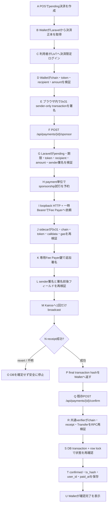

# LivT Self-hosted Fee Payer Kairos実証レビュー

最終更新: 2026-08-06

## 1. 結論

LivT Wallet、LivT Laravel、独立したLivT Fee Payer sidecarを使い、Kairos上で
LivTがJPYC決済のgasを全額負担する一連の処理を確認した。

- LivT Walletはブラウザ内でsender署名だけを行う。
- LaravelはDB正本と照合してからFee Payerへ依頼する。
- LivT Fee Payerは独立した鍵でFee Payer署名し、Kairosへ1回だけbroadcastする。
- Walletが返す成功表示は信用せず、既存の共通確認APIがreceiptとJPYC `Transfer`を再検証する。
- MetaMaskの既存決済フロー、公開route、DB schemaは置き換えていない。
- Kaia管理Fee Delegation Service、Unifi API、外部Fee Payer API keyは使用しない。
- 現在はKairos実証限定であり、Mainnetではfail-closedとする。

## 2. 実証結果

### 2.1 成功ケース

手動レビューで決済ID `16`が成功した。公開Kairos RPCからreceiptを再取得し、
次の内容を確認した。

| 項目 | 結果 |
|---|---|
| Network | Kaia Kairos |
| Chain ID | `1001` |
| Transaction type | `TxTypeFeeDelegatedSmartContractExecution` (`0x31`) |
| Transaction hash | [`0xe150...a907`](https://kairos.kaiascan.io/tx/0xe150a0baabdd2d8166ee61d8f9e1e68f1b146af81b9a60319e89f3ae0428a907) |
| Receipt status | `0x1`（成功） |
| `txError` | なし |
| Sender | `0x11e3bc89213bdb5eb33ac79590850b78369108e3` |
| Fee Payer | `0x602fe450d3c1cf4c9df035211e437ee3aaa507b7` |
| JPYC contract | `0xe7c3d8c9a439fede00d2600032d5db0be71c3c29` |
| Recipient | `0x923bfce1ac4d318441700f26ad4ecaf39522e32a` |
| Amount | `1 JPYC`（`1e18` atomic units） |
| Gas limit | `56,316` |
| Gas used | `56,048` |

秘密鍵、mnemonic、Walletパスワード、内部Bearer、署名済みraw transactionは
この文書へ記録しない。

### 2.2 実証中に発見した問題

当初、通常のERC-20 `transfer`で得たgas見積り `46,316`をFee Delegated
transactionへそのまま設定していた。このtransactionはKairosへ取り込まれたが、
receiptが`status: 0x0`、`txError: 0x09`となった。

KaiaのFee Delegated transactionでは通常のcontract callに加えて`10,000`の
intrinsic gasが必要なため、Walletの署名時gas limitを次のように修正した。

```text
feeDelegatedGasLimit = estimatedTransferGas + 10,000
                     = 46,316 + 10,000
                     = 56,316
```

修正後の決済ID 16は成功した。sidecarのgas policy上限`150,000`は維持している。

## 3. 全体フロー



## 4. Repository別の責務

| Repository | 責務と秘密情報の境界 |
|:---|:---|
| **`jpyc-web3-payment-platform`** | **責務:** 決済正本、利用者認証、sponsorship policy、共通transaction検証、DB確定<br>**境界:** Wallet鍵とFee Payer秘密鍵を保持しない |
| **`livt-wallet`** | **責務:** 支払い内容表示、端末内sender署名、sponsor/confirm API呼び出し<br>**境界:** 暗号化Walletを保持し、復号情報を端末外へ出さない |
| **`livt-fee-payer`** | **責務:** Fee Payer署名、Kairos broadcast、receipt待機<br>**境界:** 専用Fee Payer秘密鍵だけをsidecarの`.env`に保持 |

## 5. 工程と主要実装箇所

### 5.1 LivT Wallet

| 工程 | 実装とレビューポイント |
|:---|:---|
| **Fee Payer利用可否** | `livtPaymentApi.ts`<br>`getPaymentSponsorshipAvailability()` |
| **sponsorship API** | `livtPaymentApi.ts`<br>`sponsorPayment()` |
| **支払い分岐** | `livtPaymentFlow.ts`<br>`executeLivtPayment()`で直接送信とFee Delegated送信を分離 |
| **sender-only署名** | `feeDelegatedJpycTransfer.ts`<br>`executeFeeDelegatedJpycTransfer()` |
| **gas補正** | `feeDelegatedJpycTransfer.ts`<br>通常見積りへFee Delegated intrinsic gas `10,000`を加算 |
| **UI・手動切替** | `LivtPaymentPanel.tsx`<br>LivT負担表示、失敗表示、直接送信への明示切替 |
| **Edge実証runner** | `run-live-kairos-review.mjs`<br>3 process起動、実DB/RPC確認、一時Bearer生成、最終receipt検査 |

### 5.2 LivT Laravel

| 工程 | 実装とレビューポイント |
|:---|:---|
| **capability API** | `PaymentController.php`<br>`sponsorshipAvailability()` |
| **sponsorship入口** | `PaymentSponsorshipController.php`<br>`__invoke()` |
| **支払い正本との照合** | `PaymentSponsorshipService.php`<br>`sponsor()` |
| **sender-only RLP検査** | `KaiaFeeDelegatedTransactionInspector.php`<br>`inspect()` |
| **sidecar通信** | `KaiaFeeDelegationGateway.php`<br>`sponsor()` |
| **loopback制約** | `FeeDelegationEndpoint.php`<br>literal `127.0.0.1`とBearerを要求 |
| **DI** | `AppServiceProvider.php`<br>inspector/gateway interfaceを実装へbind |
| **共通確定** | `PaymentTransactionVerifier.php`<br>`verifyAndConfirm()`をMetaMaskとWalletで共用 |

追加routeは次のとおり。既存confirm routeは変更していない。

```text
GET  /api/payments/{id}/sponsorship
POST /api/payments/{id}/sponsor
POST /api/payments/{id}/confirm      # 既存の共通確定route
```

### 5.3 LivT Fee Payer

| 工程 | 実装とレビューポイント |
|:---|:---|
| **strict config** | `config.ts`<br>Kairos、HTTPS RPC、loopback、token、gas上限を検証 |
| **HTTP境界** | `http.ts`<br>`/health`、Bearer認証、body上限、安全な固定診断コード |
| **transaction policy** | `policy.ts`<br>`validateSenderTransaction()` / `validateFeePayerTransaction()` |
| **追加署名と送信** | `sponsor.ts`<br>`SponsorService.sponsor()` / `execute()` |
| **起動時検査** | `sponsor.ts`<br>`assertKairosReady()` |
| **鍵初期化** | `setup-kairos.ts`<br>専用EOA生成、mode `0600`の`.env`作成、公開アドレスだけ表示 |

## 6. Authentication boundary

1. Walletは既存のLivT利用者認証で決済限定tokenを取得する。
2. `/api/payments/{id}/sponsor`と`/confirm`は同じ`payment:confirm`能力を要求する。
3. Laravelとsidecar間はrunnerが起動ごとに生成する一時Bearerを使用する。
4. 一時BearerはLaravelとsidecarのprocess environmentだけへ渡し、Viteやブラウザへ渡さない。
5. sidecarはliteral `127.0.0.1`だけで待ち受ける。
6. `.env`へ外部サービスのAPI keyを追加する必要はない。

## 7. Wallet / Fee Payer security boundary

- Walletのmnemonic、private key、Walletパスワード、復号済みmaterialはWallet外へ送らない。
- Laravelへ送るのはsender署名済みtransactionであり、sender秘密鍵ではない。
- Fee Payer秘密鍵は`livt-fee-payer/.env`だけが保持し、LaravelとWalletへ渡さない。
- sidecarはtoken、recipient calldata形式、正のamount、value 0、gas上限、chain ID、署名数を検証する。
- Fee Payer署名後にsender fieldsが変わっていないことを比較する。
- `kaia_recoverFromTransaction`でsenderを再確認してからbroadcastする。
- sender-only rawとFee Payer署名済みrawをログへ出さない。
- 固定診断コードだけをrunnerへ表示し、RPC URLやproviderの生メッセージを公開しない。

## 8. MetaMask compatibility

- MetaMaskの画面、送信処理、routeを削除・置換していない。
- Fee Delegated処理は新しいsponsor routeの前段として追加した。
- 最終的なtx hashはMetaMaskとLivT Walletのどちらも既存`/confirm`へ渡す。
- Laravelはclient報告の成功を信用せず、同じ`PaymentTransactionVerifier`で最終確認する。
- Fee Payerを無効化するとWalletは既存の直接送信へ戻せる。

## 9. Failure / retry semantics

| 段階 | 結果 | 安全動作 |
|:---|:---:|:---|
| Walletの事前検査・署名 | Client error | sponsorを呼ばず終了 |
| Laravelのpayment/RLP検査 | `4xx` | sidecarを呼ばず終了 |
| sidecar policy | `400` | broadcastせず固定診断コードを表示 |
| signing / recovery | `503` | broadcastせず終了 |
| broadcast応答が不明 | `503` | 自動retryせず状態不明として停止 |
| receipt polling | Pending | 新規transactionを作らずpollingだけを継続 |
| receipt reverted | `502` | DBをconfirmedにしない |
| `/confirm`検証失敗 | `4xx / 5xx` | DB transactionを開始せずpendingを維持 |

Laravelもsidecarもbroadcast依頼を自動retryしない。RPC中にLaravelのDB transactionや
row lockを保持しない。

## 10. テスト結果

### LivT Fee Payer

- TypeScript typecheck: 成功
- 全テスト: `13 passed`
- policy、署名前後field保持、sender recovery、broadcast一回、曖昧結果の非retry、
  reverted再試行、安全な診断ログを確認

### LivT Wallet

- Unit: `177 passed`
- Integration: `32 passed`
- TypeScript typecheck: 成功
- ESLint: 成功
- Fee Delegated transaction type、sender-only署名、gas `+10,000`、sponsor一回、
  chain不一致、パスワード不一致、不正final hashを確認

### LivT Laravel

- payment targeted tests: `76 passed` / `542 assertions`
- Feature全体: `86 passed` / `580 assertions`
- Feature全体には既知の無関係な失敗が3件残る。
  - root URLが200ではなく404
  - `PaymentCreateTest`のStaff authentication model不整合が2件
- このFee Payer作業では上記3件を変更していない。

### 実Kairos / Edge

- 実DB、実Kairos RPC、Edge、専用Fee Payer EOAを使用
- migration、seed、reset、自動送金は未実行
- 決済ID 16でreceipt成功
- Fee Payer address、JPYC contract、sender、recipient、amountを公開receiptで照合

## 11. レビュー優先順位

1. `livt-wallet/apps/web/src/tokens/feeDelegatedJpycTransfer.ts`
   - sender-only署名、transaction type、gas補正
2. `jpyc-web3-payment-platform/app/Services/Payments/PaymentSponsorshipService.php`
   - DB正本との照合、試行予約、DB lockをRPC中に保持しないこと
3. `jpyc-web3-payment-platform/app/Services/Payments/KaiaFeeDelegatedTransactionInspector.php`
   - RLP、signature、chain、token、recipient、amount、gas検査
4. `livt-fee-payer/src/policy.ts`
   - sidecarの独立した二重policy
5. `livt-fee-payer/src/sponsor.ts`
   - 追加署名、sender recovery、broadcast一回、receipt処理
6. `jpyc-web3-payment-platform/app/Services/Payments/PaymentTransactionVerifier.php`
   - 既存共通確定経路が維持されていること
7. UI、API client、runner、テスト

## 12. コミット前の注意

- 3 repositoryを別commitとして扱う。
- `.env`、秘密情報、raw transactionをstageしない。
- Laravel repositoryの未追跡`pnpm-lock.yaml`はFee Payer作業と無関係なので含めない。
- 既存の無関係な未コミット変更を誤って含めない。
- Mainnet対応として表現せず、Kairos proofであることをcommit messageとPRへ明記する。

## 13. Mainnet前の必須課題

- Fee Payer秘密鍵をKMS/HSMへ移し、application processから分離する。
- chain ID 8217、Mainnet JPYC contract、Mainnet RPCを別設定・別鍵として追加する。
- sponsorship attemptを永続化し、複数host、cache eviction、process restartへ対応する。
- senderTxHash indexingを保証し、broadcast結果不明時の復旧手順を実装する。
- user/payment単位のrate limit、日次gas上限、残高監視、監査ログ、緊急停止を追加する。
- Mainnet前にRLP inspector、gas policy、鍵運用を独立セキュリティレビューする。
- Fee Payer残高枯渇、RPC分断、nonce競合、reorgを含む運用テストを追加する。

これらが完了するまでMainnetでは有効化しない。

## 14. レビューチェックリスト

- [ ] Wallet秘密情報がWallet外へ送信されない
- [ ] Fee Payer秘密鍵がsidecar外へ出ない
- [ ] sender-only transactionのchain/token/recipient/amount/value/gasをLaravelが検査する
- [ ] sidecarが同じpolicyを独立して再検査する
- [ ] Fee Payer署名前後でsender fieldsが変わらない
- [ ] broadcastは一度だけで、曖昧結果を自動retryしない
- [ ] RPC中にDB transactionまたはrow lockを保持しない
- [ ] sponsorship APIはpaymentをconfirmedへ変更しない
- [ ] 最終確定は既存`PaymentTransactionVerifier`だけが行う
- [ ] receipt失敗時に`tx_hash`、`user_id`、`paid_at`を更新しない
- [ ] MetaMaskの既存フローが維持される
- [ ] Fee Payer無効化で直接送信へrollbackできる
- [ ] `.env`と秘密情報がcommit対象外である
- [ ] Mainnetではfail-closedである
