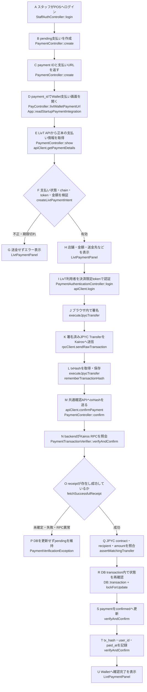

# LivT Wallet 支払いフロー実装対応表

この資料の`Flow A`〜`Flow U`は、LaravelとLivT Walletのコードコメントで共通利用するレビュー用識別子です。Walletが表示する成功状態をLaravelは信用せず、`Flow N`以降でKairosの実データを再検証します。

## フローチャート

## 工程と実装箇所

表内の矢印（`→`）は、同じFlow内での呼び出し順を示します。

### 1. POSで支払いを作成してWalletを開く

| Flow | 主体 | 処理 | 実装（呼び出し順） |
|:---:|---|---|---|
| **A** | Laravel | POSスタッフを認証 | `app/Http/Controllers/Api/StaffAuthController.php` `login()` |
| **B** | Laravel | pending支払いを作成 | `app/Http/Controllers/Api/PaymentController.php` `create()` |
| **C** | Laravel | payment ID・支払いURL・QRを返す | `app/Http/Controllers/Api/PaymentController.php` `create()`のresponse |
| **D** | Laravel → Wallet | `payment_id`だけをWalletへ渡して支払い画面を開く | `app/Http/Controllers/PayController.php` `livtWalletPaymentUrl()` → `apps/web/src/app/App.tsx` `readStartupPaymentIntegration()` |
| **E** | Wallet ↔ Laravel | backendを正本として支払い情報を取得 | `apps/web/src/payments/livtPaymentApi.ts` `getPaymentDetails()` → `app/Http/Controllers/Api/PaymentController.php` `show()` |

### 2. Walletで内容を検証・表示・送信する

| Flow | 主体 | 処理 | 実装（呼び出し順） |
|:---:|---|---|---|
| **F** | Wallet | ID・状態・期限・chain・token・金額・残高を検証 | `apps/web/src/payments/livtPaymentIntent.ts` `createLivtPaymentIntent()` |
| **G** | Wallet | 検証失敗時は送金せずエラー表示 | `apps/web/src/app/LivtPaymentPanel.tsx` `paymentValidation` → `displayedDetailsError` |
| **H** | Wallet | backend由来の支払い内容を表示 | `apps/web/src/app/LivtPaymentPanel.tsx` `LivtPaymentPanel()`の確認画面 |
| **I** | Wallet ↔ Laravel | LivT利用者を決済限定tokenで認証 | `LivtPaymentPanel.tsx` `handleLogin()` → `livtPaymentApi.ts` `login()` → `PaymentAuthenticationController.php` `login()` |
| **J** | Wallet | 秘密情報を外へ出さず端末内で署名 | `apps/web/src/tokens/jpycTransfer.ts` `executeJpycTransfer()` → `account.signTransaction()` |
| **K** | Wallet → Kairos | 署名済みtransactionを一度だけ送信 | `apps/web/src/tokens/jpycTransfer.ts` `rpcClient.sendRawTransaction()` |
| **L** | Wallet | txHashを算出・取得してブラウザへ保存 | `jpycTransfer.ts` `executeJpycTransfer()` → `LivtPaymentPanel.tsx` `rememberTransactionHash()` |

### 3. 共通backendでtransactionを検証・確定する

| Flow | 主体 | 処理 | 実装（呼び出し順） |
|:---:|---|---|---|
| **M** | Wallet / MetaMask → Laravel | txHashを共通確認APIへ送る | Wallet: `livtPaymentFlow.ts` `executeLivtPayment()` → `livtPaymentApi.ts` `confirmPayment()` MetaMask: `resources/views/pay.blade.php` `confirmPayment()` 共通入口: `PaymentController.php` `confirm()` |
| **N** | Laravel → Kairos | chain IDとreceiptをRPC照会 | `app/Services/Payments/PaymentTransactionVerifier.php` `verifyAndConfirm()` → `verifyChainId()` / `rpcResult()` |
| **O** | Laravel → Kairos | receiptを既存上限まで待ち、成功状態を確認 | `PaymentTransactionVerifier.php` `fetchSuccessfulReceipt()` |
| **P** | Laravel | RPC・receipt・Transfer検証失敗時はDBを更新しない | `PaymentTransactionVerifier.php` `verifyAndConfirm()`のDB transaction開始前 |
| **Q** | Laravel | JPYC contract・recipient・amountを照合 | `PaymentTransactionVerifier.php` `assertMatchingTransfer()` |
| **R** | Laravel / DB | row lock下で支払い状態とTransferを再確認 | `PaymentTransactionVerifier.php` `DB::transaction()` → `lockForUpdate()` |
| **S** | Laravel / DB | paymentを`confirmed`へ更新 | `PaymentTransactionVerifier.php` `verifyAndConfirm()`の`update()` |
| **T** | Laravel / DB | `tx_hash`・`user_id`・`paid_at`を保存 | `PaymentTransactionVerifier.php` `verifyAndConfirm()`の同じ`update()` |

### 4. Walletへ確定結果を表示する

| Flow | 主体 | 処理 | 実装 |
|:---:|---|---|---|
| **U** | Wallet | backend確認後に確定状態とtxHashを表示 | `apps/web/src/app/LivtPaymentPanel.tsx` `submissionStatus === 'confirmed'` |

## 手動Kairosレビュー時の入口

今回のEdge手動レビューでは、`apps/web/e2e/payment/support/run-live-kairos-review.mjs`が入力されたpayment IDを安全確認してから、`Flow D`と同じ`payment_id`付きWallet URLを開きました。これは本番支払いロジックではなく、実DB・実Kairosを使ってA〜Uを追跡するためのレビュー補助です。

## セキュリティ境界

- `Flow J`では署名がブラウザ内で完結し、mnemonic・private key・WalletパスワードをLaravelへ送りません。
- `Flow M`で送られるのは決済限定Bearer tokenとtxHashです。
- `Flow N`〜`Q`は送金元UIに依存しないため、MetaMaskとLivT Walletが同じ検証経路を使います。
- RPC呼び出しは`Flow R`のDB transactionより前に完了します。
- `Flow O`または`Q`で失敗した場合、`Flow S`〜`T`へ進まずpaymentはpendingのままです。
