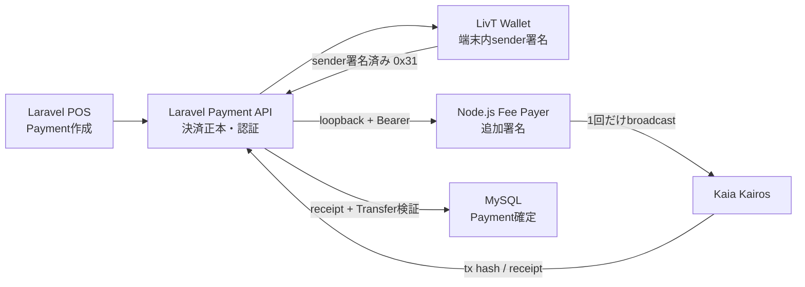

# LivT Kaia Mainnet移行設計

最終更新: 2026-09-07
状態: Phase 1〜6実装済み、Phase 7 live Kairos managed test準備済み。live送信未実施、Mainnet実行は無効

## 0. 目的と結論

この文書は、次の3リポジトリを横断して、既存のKaia Kairos開発環境を維持したままKaia Mainnet対応を準備する実装計画である。

- `jpyc-web3-payment-platform`
- `livt-wallet`
- `livt-fee-payer`

採用する共通network IDは次の2つとする。

| network ID | chain ID | 用途 |
|---|---:|---|
| `kairos` | `1001` (`0x3e9`) | 開発・自動テスト・手動レビュー |
| `kaia-mainnet` | `8217` (`0x2019`) | 将来の本番・少額Mainnet試験 |

Kaia Mainnet上のJPYCは、公式情報に掲載された次の値をコード内の承認済みprofileへ固定する。

- contract: `0xE7C3D8C9a439feDe00D2600032D5dB0Be71C3c29`
- decimals: `18`
- symbol: `JPYC`

参照:

- [JPYC公式GitHub](https://github.com/jpycoin)
- [Kaia: JPYC Is Live On Kaia](https://www.kaia.io/jpyc)
- [Kaia network / RPC information](https://docs.kaia.io/references/public-en/)

Mainnet対応はchain IDの置換ではない。最初にnetwork profileとPayment snapshotを導入し、Kairosで回帰試験する。Mainnet Fee Payerへの接続と実JPYC送金はこの計画の実装対象外である。

## 1. 現在のアーキテクチャ



責務境界は適切であり、維持する。

- Walletはユーザー秘密鍵を端末外へ出さない。
- LaravelはPaymentの正本、認証、sponsorship前検査、receipt検証、DB確定を担当する。
- Fee Payerは専用gas sponsor鍵だけを扱い、ユーザー秘密情報を扱わない。
- sponsorship成功だけではPaymentを確定せず、共通`PaymentTransactionVerifier`を必ず通す。
- broadcast依頼は自動retryしない。receipt pollingだけを再試行できる。

## 2. 現在のKairos固有前提

### 2.1 jpyc-web3-payment-platform

| ファイル | 現在の前提・問題 |
|---|---|
| `config/services.php` | `WEB3_NETWORK`が`kairos`なら1001、それ以外はSepoliaという二分岐。RPC、token、explorerも同じ条件へ結合している。 |
| `app/Http/Controllers/Api/PaymentController.php` | Payment表示時に現在のglobal configと現在の店舗walletを読み、atomic amountを再計算する。fee delegation可否もKairos/1001へ固定。 |
| `app/Models/Payment.php` | blockchain条件を保持しない。 |
| `app/Services/Payments/PaymentTransactionVerifier.php` | RPC・token・decimals・recipientを現在設定から取得。receiptのhash/block情報、logの`removed`、payerを保存しない。 |
| `app/Services/Payments/PaymentSponsorshipService.php` | `assertKairosEnabled()`、chain ID 1001、decimals 18、現在の店舗walletへ固定。 |
| `app/Services/Payments/KaiaFeeDelegatedTransactionInspector.php` | sender署名から導くchain IDを1001へ固定。 |
| `app/Services/Payments/KaiaFeeDelegationGateway.php` | provider response形状とendpoint設定を現在の単一Fee Payerとして扱う。 |
| `app/Services/Payments/FeeDelegationEndpoint.php` | HTTPSまたは認証付きliteral loopbackを許可。将来のmanaged service adapterでも再評価が必要。 |
| `app/Providers/AppServiceProvider.php` | Kaia inspector/gatewayを常に同じ実装へbind。 |
| `database/migrations/*payments*` | `amount`はsigned `INTEGER`、`tx_hash`はchainを含めず単独unique。snapshot列がない。 |
| `database/migrations/*wallets*` | `wallets.network`はnullableで、`(store_id, network)`一意制約がない。 |
| `database/seeders/PaymentBrowserTestSeeder.php` | Kairos fixtureを直接設定。 |
| `database/seeders/TestDataSeeder.php` | 店舗wallet networkをKairosへ直接設定。 |
| `tests/Feature/PaymentCreateTest.php` | 現在schemaの作成結果を前提にする。 |
| `tests/Feature/PaymentDetailsTest.php` | config由来のKairos詳細を前提にする。 |
| `tests/Feature/PaymentConfirmTest.php` | chain 1001、単独tx hash uniqueness、現在wallet/configによる検証を前提にする。 |
| `tests/Feature/PaymentSponsorshipTest.php` | Kairos RLPと現在のcache reservationを前提にする。 |
| `.env.example`、`README.md`、`docs/kairos-*`、`docs/livt-wallet-*` | 現在の変数名とKairos限定手順を記載。既存のKairos証跡は削除せず、Mainnet計画から参照する。 |

`composer.lock`や`public/js/ethers.umd.min.js`にも検索上の文字列は存在するが、network profile導入の変更対象ではない。

### 2.2 livt-wallet

| ファイル群 | 現在の前提・問題 |
|---|---|
| `apps/web/src/blockchain/kairos.ts` | chain 1001、Kairos RPC、Kairos explorer、`testnet: true`を一体で定義。 |
| `activeNetwork.ts` | Kairosしか返さない。 |
| `kairosClient.ts`、`kairosTransaction.ts`、`kairosBalance.ts`、`kairosChainVerification.ts`、`kairosRpcError.ts` | 型名・client・検査・表示がKairos固有。receiptは1 confirmation。 |
| `apps/web/src/tokens/tokenRegistry.ts` | 承認tokenをKairos chain 1001へ限定。 |
| `erc20Client.ts`、`jpycTransferClient.ts`、`jpycTransfer.ts`、`tokenBalance.ts`、`tokenMetadata.ts` | Kairos clientを直接import。 |
| `feeDelegatedJpycTransfer.ts` | SDKの`kairos` chain、1001署名、Kairos RPCへ固定。 |
| `apps/web/src/payments/livtPaymentIntent.ts` | backendのnetworkが`kairos`かつchain 1001であることを固定検査。 |
| `apps/web/src/app/App.tsx`、`ReceivePanel.tsx`、`SettingsPanel.tsx`、`JpycTransferPanel.tsx`、`LivtPaymentPanel.tsx` | network名、chain ID、エラー文、explorer linkをKairos定数から表示。 |
| `apps/web/e2e/payment/support/run-payment-e2e.mjs` | isolated DB/stubをKairos環境変数で起動。 |
| `kairos-rpc-stub.mjs`、`kairos-receipt.mjs` | chain 1001とKaia fee delegation receiptを直接表現。 |
| `run-live-kairos-review.mjs` | 実Kairos専用runner。これはMainnet runnerへ変えず、Kairos回帰試験として維持する。 |
| `apps/web/tests/**`、`apps/web/e2e/**` | 多数のfixture、期待値、説明文が1001/Kairosへ固定。 |
| `apps/web/.env.example`、`README.md`、`docs/*`、各`package.json` | Kairos用変数・script・手順を記載。 |

### 2.3 livt-fee-payer

| ファイル | 現在の前提・問題 |
|---|---|
| `src/config.ts` | `KAIROS_RPC_URL`と平文process private keyを必須にする。network/chain IDをconfig objectに持たない。 |
| `src/policy.ts` | sender/fee-payer署名のchain IDを1001へ固定。type `0x31`、token、value 0、gas、calldata検査自体は維持対象。 |
| `src/sponsor.ts` | SDK `kairos` chainへ固定。Mapだけで重複実行を抑止。1 confirmation。readinessは1001とbytecode存在だけを確認。 |
| `src/http.ts` | `/health`が常に`network: kairos`を返す。 |
| `src/server.ts` | Kairos readinessを呼ぶ。現在の未コミット差分に`FEE_PAYER_SKIP_KAIROS_CHECK`があり、環境変数だけで検査を回避できる。 |
| `src/setup-kairos.ts` | Kairos専用EOAを`.env`へ生成する開発補助。Mainnet鍵作成へ流用しない。 |
| `tests/config.test.ts`、`tests/policy.test.ts`、`tests/sponsor.test.ts`、`tests/http.test.ts`、`tests/fixtures.ts` | Kairos chain/signature/health/configを固定。 |
| `.env.example`、`README.md`、`AGENTS.md` | Kairos proof限定の鍵・RPC・運用境界を定義。 |

## 3. Network profile設計

### 3.1 原則

1. `APP_ENV`、`NODE_ENV`とblockchain networkを結合しない。
2. 3リポジトリでnetwork IDを`kairos` / `kaia-mainnet`へ統一する。
3. chain ID、公式JPYC address、decimals、symbol、explorerはコード内の承認済みprofileへ固定する。
4. 環境変数は「profile選択」「RPC endpoint」「機密情報」「運用上限」に使う。Mainnet token addressを自由入力値にしない。
5. Payment作成時だけactive profileを使う。作成後の検証条件はPayment snapshotを使う。
6. Profileが存在してもMainnet Fee Payerは初期状態で必ず無効にする。

許可する例:

```text
APP_ENV=production
BLOCKCHAIN_NETWORK=kairos
```

禁止する実装例:

```text
APP_ENV=production なら自動的に kaia-mainnet
NODE_ENV=development なら自動的に kairos
```

### 3.2 共通profile形状

各言語で同じ意味のimmutable value objectを実装する。

```text
NetworkProfile
  id                  kairos | kaia-mainnet
  version             1
  chainId             1001 | 8217
  chainIdHex          0x3e9 | 0x2019
  chainName
  nativeCurrency      KAIA / 18
  rpcUrl
  explorerUrl
  isTestnet
  jpyc.contract
  jpyc.symbol         JPYC
  jpyc.decimals       18
  feeDelegation.mode  disabled initially for kaia-mainnet
  feeDelegation.maxGas
```

Profile `version`は、同じnetwork IDのポリシー内容を将来変更した際に増やす。RPC URLのrotationだけでは増やさず、chain/token/decimalsなど決済意味論が変わる場合に増やす。

### 3.3 Repository別配置

#### Laravel

- 新規: `config/blockchain.php` — 承認済みprofile mapと選択用環境変数名
- 新規: `app/Blockchain/NetworkProfile.php`
- 新規: `app/Blockchain/NetworkProfileRegistry.php`
- 新規: `app/Blockchain/BlockchainReadinessChecker.php`
- 変更: `app/Providers/AppServiceProvider.php` — boot時検査とDI
- `config/services.php`からweb3 profile定義を移し、外部Fee Payer transport設定だけを残す。

#### Wallet

- 新規: `apps/web/src/blockchain/networkProfiles.ts`
- 新規: `apps/web/src/blockchain/networkProfile.ts`
- 新規: `apps/web/src/blockchain/networkClient.ts`
- `kairos.ts`等の汎用部分を上記へ移し、Kairos固有exportは互換shimとして段階的に廃止する。
- APIから受けたPaymentのnetwork IDで任意profileへ切り替えない。Wallet buildで承認したactive profileとPayment snapshotが一致する場合だけ署名する。

#### Fee Payer

- 新規: `src/network-profiles.ts`
- 新規: `src/readiness.ts`
- `FeePayerConfig`へ`networkId`、`chainId`、`chain`、`profileVersion`を追加する。
- `validateSenderTransaction()` / `validateFeePayerTransaction()`へ期待chain IDを引数で渡す。
- Mainnet profileを定義しても、Mainnet signer/broadcast adapterはこの段階では登録しない。

### 3.4 環境変数名

既存`.env`はこの作業で変更しない。実装時に`.env.example`へ次を追加し、旧変数は移行期間だけ対応する。

#### 共通論理名

```text
BLOCKCHAIN_NETWORK=kairos
```

値なし、空文字、未知の値、大文字小文字の曖昧変換は拒否する。暗黙defaultを設けない。

Phase 1実装では既存Wallet buildとの互換性に限り、
`VITE_BLOCKCHAIN_NETWORK`自体が未定義の場合だけ安全な`kairos`を選ぶ。空文字・不正値は
拒否し、純粋なprofile resolverはdefaultなしで検証する。LaravelとFee Payerには
この例外を設けない。Mainnetが暗黙選択される経路は存在しない。

#### Laravel

```text
BLOCKCHAIN_KAIROS_RPC_URL=
BLOCKCHAIN_KAIA_MAINNET_RPC_URL=
BLOCKCHAIN_KAIA_MAINNET_SECONDARY_RPC_URL=
PAYMENTS_MAINNET_ENABLED=false
MAINNET_FEE_DELEGATION_ENABLED=false
MAINNET_BROADCAST_ENABLED=false
MAINNET_READINESS_MAX_BLOCK_LAG=10
PAYMENT_MAX_JPY=100000
PAYMENT_EXPIRATION_SECONDS=600

FEE_DELEGATION_MODE=self-hosted
FEE_DELEGATION_KAIROS_URL=http://127.0.0.1:19000
FEE_DELEGATION_KAIROS_API_KEY=

# 将来用。今回接続しない。
FEE_DELEGATION_KAIA_MAINNET_URL=
FEE_DELEGATION_KAIA_MAINNET_API_KEY=
MAINNET_FEE_DELEGATION_ENABLED=false
```

Phase 4のread-only readinessでは3つのexecution flagがすべてfalseであることを要求する。`PAYMENTS_MAINNET_ENABLED=true`だけでは将来も不十分で、`BLOCKCHAIN_NETWORK=kaia-mainnet`、`MAINNET_BROADCAST_ENABLED=true`、DB/readiness条件とのANDを必要とする。Fee delegationはさらに`MAINNET_FEE_DELEGATION_ENABLED=true`が必要で、現在はtrueを受け付けずfail closedにする。

#### Wallet

```text
VITE_BLOCKCHAIN_NETWORK=kairos
VITE_BLOCKCHAIN_KAIROS_RPC_URL=
VITE_BLOCKCHAIN_KAIA_MAINNET_RPC_URL=
VITE_LIVT_API_BASE_URL=
VITE_MAINNET_PAYMENTS_ENABLED=false
```

ブラウザへ渡る`VITE_*`は秘密情報ではない。API key付きRPCを直接埋め込まず、browser origin制限済みendpointまたはbackend proxyを使う。

#### Fee Payer

```text
BLOCKCHAIN_NETWORK=kairos
FEE_PAYER_KAIROS_RPC_URL=
FEE_PAYER_KAIROS_PRIVATE_KEY=
FEE_PAYER_API_KEY=
FEE_PAYER_SPONSORING_ENABLED=true

# 将来のself-hosted Mainnet用。平文private key変数は定義しない。
FEE_PAYER_KAIA_MAINNET_RPC_URL=
FEE_PAYER_SIGNER_MODE=kms
FEE_PAYER_KMS_KEY_ID=
FEE_PAYER_MAINNET_ENABLED=false
FEE_PAYER_DAILY_BUDGET_PEB=
FEE_PAYER_MAX_GAS=
FEE_PAYER_RECEIPT_TIMEOUT_MS=
```

Mainnet signerはKMS/HSM等のkey referenceを使い、秘密鍵本体をapplication processの環境変数へ渡さない。

### 3.5 Fail-closed条件

次のいずれかなら起動時readinessを失敗させ、Payment作成・署名・sponsorshipを受け付けない。

- `BLOCKCHAIN_NETWORK`が未設定またはunsupported
- 選択profile用RPC URLが未設定、不正、または許可されないscheme
- RPCの`eth_chainId`とprofileのchain IDが不一致
- 承認済みJPYC addressの`eth_getCode`が空
- `symbol()`または`decimals()`がprofileと不一致
- Mainnetを選んだのにMainnet明示enable flagがfalse
- Mainnet Fee Payerを選んだのに専用enable flag、signer、budgetのいずれかが不足
- Mainnet processでtest bypassが存在または有効

Mainnetではproxy implementation/code hashもprofile versionごとにallowlist化する。ただしJPYC側の正規upgradeを単なる障害として扱わないよう、変更検知時は自動許可せず停止・公式確認・profile version更新という手順にする。

## 4. Payment snapshot設計

### 4.1 解決した問題

Phase 2以前の`show()`、`PaymentTransactionVerifier`、`PaymentSponsorshipService`は、Payment作成後も次を読み直していた。

- `services.web3.*`の現在値
- `payment.store.wallet.address`の現在値
- token decimalsから再計算したatomic amount

Phase 2でPayment作成時の条件を不変snapshotとして保存し、表示、sponsorship検査、confirmation検証の正本へ切り替えた。RPC URL、chain name、native currency、explorer URLは実行・表示用の現在profileから解決するが、chain、token、recipient、amountを再定義しない。snapshotted networkへ安全に接続できない場合はfail closedとする。

### 4.2 推奨列

`payments`へ次を追加する。アドレスとhashは作成前にlowercase canonical formへ正規化する。

| 列 | MySQL型 | null | 内容 |
|---|---|---:|---|
| `network` | `VARCHAR(32)` ASCII/BINARY collation | migration中のみ可 | `kairos` / `kaia-mainnet` |
| `network_profile_version` | `SMALLINT UNSIGNED` | migration中のみ可 | 作成時profile version |
| `chain_id` | `BIGINT UNSIGNED` | migration中のみ可 | 作成時chain ID |
| `token_contract` | `CHAR(42)` ASCII/BINARY collation | migration中のみ可 | lower-case `0x...` |
| `token_symbol` | `VARCHAR(16)` ASCII/BINARY collation | migration中のみ可 | 表示・監査用。検証はcontractを正本とする |
| `token_decimals` | `TINYINT UNSIGNED` | migration中のみ可 | 作成時decimals |
| `recipient_address` | `CHAR(42)` ASCII/BINARY collation | migration中のみ可 | 作成時店舗wallet |
| `display_amount` | `BIGINT UNSIGNED` | migration中のみ可 | 整数JPYC。APIではstringとして返す |
| `atomic_amount` | `VARCHAR(78)` ASCII/BINARY collation | migration中のみ可 | canonical unsigned decimal string |
| `observed_chain_id` | `BIGINT UNSIGNED` | yes | 同期確認時にRPCから観測したchain ID |
| `payer_address` | `CHAR(42)` ASCII/BINARY collation | yes | 実Transfer eventのsender |
| `tx_hash` | 既存`VARCHAR(255)` unique | yes | lower-case final transaction hash。Stage 2で型・uniqueを強化 |
| `confirmed_block_number` | `BIGINT UNSIGNED` | yes | receipt block number |
| `confirmed_block_hash` | `CHAR(66)` ASCII/BINARY collation | yes | receipt block hash |
| `receipt_status` | `TINYINT UNSIGNED` | yes | 同期確認で受理した成功値`1` |
| `transfer_log_index` | `INT UNSIGNED` | yes | 採用したTransfer log |
| `chain_confirmed_at` | `TIMESTAMP` | yes | 対象block timestamp |
| `verified_at` | `TIMESTAMP` | yes | 同期検証時刻 |
| `reconciliation_status` | `VARCHAR(32)` ASCII/BINARY collation | yes | `pending` / `verified` / `anomaly` / `transient_failure` |
| `reconciliation_error_code` | `VARCHAR(64)` ASCII/BINARY collation | yes | 秘密を含まない固定診断code |
| `reconciled_at` | `TIMESTAMP` | yes | 後続照合時刻 |

`atomic_amount`を`VARCHAR(78)`にする理由は、ERC-20の`uint256`全域が最大78桁であり、MySQL `DECIMAL`の最大精度65桁では一般形を表現できないためである。application layerとDB `CHECK`で`^[1-9][0-9]{0,77}$`を保証し、比較はGMP/BCMath/BigIntで行う。浮動小数点を使用しない。

`display_amount`は現在の商品仕様では整数JPYだけを受け付ける。`numeric` validationは使用せず、canonical decimal integer、`1..PAYMENT_MAX_JPY`として検証する。JPYCは18 decimalsだが、LivTの商品価格まで小数円にする要件は現在ない。将来小数を許可するときは別profile/schema versionとして扱う。

既存`amount`は第一段階で残し、`display_amount`とのdual-write期間を設ける。新規コードがsnapshotのみを正本として動作した後に、別migrationで廃止を判断する。

### 4.3 Indexと制約

- target unique (Stage 2): `UNIQUE(chain_id, tx_hash)`
- lookup: `INDEX(status, expires_at)`
- merchant history: `INDEX(store_id, created_at)`
- reconciliation: `INDEX(status, reconciliation_status, reconciled_at)`
- optional investigation: `INDEX(chain_id, payer_address, confirmed_block_number)`

Phase 3時点では単独`UNIQUE(tx_hash)`を維持する。Stage 2で`UNIQUE(chain_id, tx_hash)`へ変更し、同じ256-bit hashが別chainに存在する可能性をデータモデル上区別しつつ、同一chain内で同じtransactionを複数Paymentへ流用できないようにする。nullable tx hashはpending Payment間で衝突しない。

MySQL 8.4の`CHECK`とapplication validationの両方で、network allowlist、chain ID正数、address/hash形式、token decimals、amount文字列を検査する。Laravel validationだけに依存しない。

店舗walletはMainnet混同防止のため、最終的に`wallets.store_id`、`wallets.network`、`wallets.address`をnon-nullとし、`UNIQUE(store_id, network)`を追加する。Payment作成時はactive profileと同じnetworkのwalletだけを選び、そのaddressをsnapshotする。

### 4.4 段階的migration

Phase 2ではStage 1としてsnapshot列をnullableで追加し、新規Paymentのdual-writeとsnapshot readを実装した。既存行を現在設定から自動backfillせず、不完全なlegacy pending Paymentの表示、sponsorship、confirmationはfail closedとする。`expires_at`を含むsnapshot列はapplication modelで更新不可にした。

実装順序と現在状態は次のとおり。

1. snapshot列をnullableで追加する。（Phase 2実装済み）
2. 新規Paymentをsnapshot付きでdual-writeする。（Phase 2実装済み）
3. `show()`、sponsorship、confirmationをsnapshot readへ切り替える。（Phase 2実装済み）
4. snapshotを持たないlegacy pending Paymentはsponsor/confirmせず、期限切れ後に終了させる。（Phase 2実装済み）
5. legacy confirmed Paymentは必要なら保存済みreceiptから監査可能な範囲だけbackfillする。現在の店舗walletからrecipientを推測しない。
6. 全新規Paymentがsnapshotを持つことを検査する。
7. 第二migrationでsnapshot列をnon-null化し、単独tx hash uniqueをcomposite uniqueへ置換する。
8. `amount`廃止は別リリースで判断する。

Phase 2では`(chain_id, tx_hash)`のlookup indexとapplication側の同一chain重複検査を追加した。一方、legacy行の`chain_id`を推測できないため、DBの単独`UNIQUE(tx_hash)`は維持する。composite uniqueへの置換は安全なbackfillとStage 2 migrationの後に行う。

Phase 3ではconfirmation evidence列もnullableで追加した。同期confirmに成功した新規行では全証拠を同じDB更新で保存するが、historical confirmed Paymentへblock/payer/receipt情報を自動補完しない。

Phase 4では`payments:audit-mainnet-migration`とStage 2 migrationを追加した。Stage 2は全行のsnapshot、canonical tx hash、same-chain duplicate、confirmed evidenceをDDL前に検査し、1件でも安全性を証明できなければ停止する。合格時だけsnapshot列をNOT NULL化し、`tx_hash`をlowercase `CHAR(66)`へ限定して、単独`UNIQUE(tx_hash)`を`UNIQUE(chain_id, tx_hash)`へ置換する。confirmed行のevidence必須CHECKも同じALTERで追加する。

現在のlocal MySQLはPhase 2/3が未適用で、read-only監査結果は11件すべて`C_ambiguous`である。この状態ではStage 2を実行しない。曖昧なpending行は推測で補完せず、運用判断により別途隔離・archiveした後で再監査する。

監査commandの分類は次のとおり。

| category | 意味 |
|---|---|
| `A_valid` | snapshotが完全・整合し、confirmedならevidenceも完全 |
| `B_backfillable` | operator承認済みKairos historical manifestでsnapshotを再構成可能 |
| `C_ambiguous` | source不足、schema未適用、またはconfirmed evidence不足 |
| `D_invalid` | partial snapshotまたは内部矛盾 |

backfillは`--manifest`を指定してもdry-runが既定であり、`--apply`を同時指定した場合だけ書き込む。manifestは`trusted_historical_export`、`sha256:<64 lowercase hex>`のsource reference、`kairos`、recipientを要求する。既存`amount`と`expires_at`は変更せず、承認済みKairos profileからsnapshotを構成する。Mainnet指定、partial/complete snapshot、無効なsourceは対象外で、confirmation evidenceは一切補完しない。

## 5. Mainnet-safe transaction verification

### 5.1 同期確認フロー

1. `payment_id`とtx hash形式を検査する。
2. Paymentを読み、snapshot完全性、status、期限ポリシーを検査する。
3. `payment.network`から承認済みprofileを解決する。現在のactive networkは参照しない。
4. profileのRPCへ`eth_chainId`を問い合わせ、`payment.chain_id`とprofile chain IDの両方に一致させる。
5. `eth_getTransactionByHash`と`eth_getTransactionReceipt`を取得する。
6. request hash、transaction hash、`receipt.transactionHash`がすべて同じcanonical hashであることを確認する。
7. receipt `status == 0x1`、`blockNumber`、`blockHash`、logsの型と存在を確認する。
8. block numberでcanonical blockを取得し、返却hash/numberとtransaction一覧がreceipt/requested txに一致することを確認する。
9. block timestampが`payment.created_at <= timestamp <= payment.expires_at`であることを確認する。
10. `removed != true`であるlogだけを対象にする。
11. log addressが`payment.token_contract`、topic0がERC-20 `Transfer`、recipientとatomic amountがsnapshotへ一致することを確認する。
12. topic1から実payer addressを取得する。zero addressからのmintは決済として拒否する。
13. 同一`(chain_id, tx_hash)`の別Payment利用を検査する。
14. RPC処理完了後、短いDB transactionとPayment row lockを開始する。
15. snapshot/status/duplicateを再検査し、Payment、payer、tx/block/log evidenceを同じ更新で保存する。（Phase 3実装済み）

txが存在するchainはchain固有RPCによって決まり、RPC自体のchain ID検査を必須とする。receiptだけで「実chain」を推測しない。

期限はconfirm API呼出時刻ではなく、取り込みblock timestampで判定する。期限内に取り込まれたtransactionがRPC遅延で後から確認された場合を正しく扱える。同期入口では、明らかに期限切れかつtx evidenceがないPaymentへの無制限pollingを避ける。

### 5.2 Kaia finality

Kaiaはoptimized Istanbul BFTを使用し、合意済みblockにはimmediate finalityがある。Ethereum PoW型の確率的な「N confirmations待ち」をそのまま採用する必要はない。

参照:

- [Kaia Execution Model](https://docs.kaia.io/learn/computation/execution-model/)
- [Kaia Consensus Mechanism](https://docs.kaia.io/learn/consensus-mechanism/)

LivTの同期確定条件は「transactionと成功receiptを取得し、両者のtx hash・block number・block hashが一致し、その高さを`eth_getBlockByNumber`で引いたcanonical blockのhash/numberとも一致すること」とした。`KaiaFinalityPolicy`は追加confirmation block数を0とし、block timestampがPayment作成から期限までの範囲内であることを要求する。追加block数はsecurity finalityではなく、RPC providerの伝播・可用性確認として扱う。

Mainnetでは可能なら独立したsecondary RPCでもchain ID、receipt hash、block hashを照合する。provider不一致時は確定せず`verification_pending`相当として再照合へ送る。

### 5.3 非同期reconciliation

同期決済とは別に、confirmed Paymentを短時間後と定期的に再検査する。

- receiptが同じchain/tx/block hashで存在する
- statusが成功のまま
- 採用Transfer logが同じ
- payer/recipient/amount/tokenがsnapshotと一致
- duplicate ledger invariantが維持される

Kaiaの合意済みblockが通常reorgすることを想定したconfirmation待ちではなく、RPC障害、provider誤応答、DB不整合、運用ミスを検知するための照合である。不一致時に自動で店舗売上を取り消さず、Paymentを要調査状態へ置き、alertと手動runbookを起動する。

Phase 3では`php artisan payments:reconcile {payment?}`を追加した。transactionを生成・署名・broadcastせず、保存済みsnapshotとconfirmation evidenceを同じread-only RPC検査へ通す。結果は次のreconciliation metadataにのみ記録し、元のtx/block/payer evidenceは変更しない。

| status | 意味 |
|---|---|
| `pending` | 同期confirm済み、後続照合前 |
| `verified` | 保存証拠と現在のchain照会が一致 |
| `anomaly` | receipt消失、block/Transfer不一致、証拠欠損など要調査 |
| `transient_failure` | timeout、transport/provider一時障害。Payment無効とは扱わない |

`reconciled_at`は試行時刻、`reconciliation_error_code`は秘密を含まない固定診断codeである。anomalyや一時障害はwarning logへPayment IDと診断codeだけを出す。

### 5.4 requester、payer、recipient

次を別概念として扱う。

- `requester_user_id`: confirm/sponsor APIを認証したLivT user。現在の`payments.user_id`の意味を明文化またはrenameする。
- `payer_address`: Transfer event topic1の実送金元。
- `recipient_address`: Payment作成時にsnapshotした店舗wallet。

現在の実装はTransfer senderを検証していないため、実質的に第三者支払いを許す。商品仕様が第三者支払いを禁止すると決まるまでは、`payer_address == users.wallet_address`を自動的に必須にしない。

第三者支払いを許可する場合、UIと履歴では「ログインユーザーが支払った」と断定せず、「このユーザーが確認した決済」「オンチェーン支払元」のように分けて表示する。本人wallet限定に変更する場合は、別の仕様決定と移行テストを必要とする。

## 6. Fee Payer互換性と将来設計

### 6.1 現在のlifecycle

Fee Payer sidecarはsender rawのSHA-256 fingerprintをkeyに、次のPromiseをprocess内Mapへ保存する。

```text
validate sender
  -> Mapへin-flight Promise保存
  -> fee-payer署名
  -> 署名前後field検証
  -> sender recovery
  -> expected full tx hash計算
  -> 1回broadcast
  -> receipt polling
  -> successならMapに結果を保持
  -> reverted / policy rejectionならMapから削除
  -> ambiguous errorならrejected Promiseを保持
```

同一process内の同時実行は抑止できるが、再起動、1000件超過eviction、複数instanceでは状態を失う。Laravel側にもPayment単位のcache reservationがあるが、file cacheは複数hostの永続台帳ではない。

### 6.2 将来の永続状態モデル

Mainnet Fee Payer実装時には、raw transactionをログへ保存せず、最低限次を永続化する。

| field | 用途 |
|---|---|
| `network`, `chain_id` | chain境界 |
| `payment_id` | Laravel Paymentとの対応 |
| `sender_tx_fingerprint` | 同一sender rawの冪等性key |
| `sender_tx_hash` | Kaia sender transaction hash（provider対応時） |
| `sender_address`, `sender_nonce` | unknown時の調査 |
| `fee_payer_address` | 使用したsponsor鍵 |
| `full_tx_hash` | 署名後、broadcast前に計算したhash |
| `state` | 下記状態 |
| `policy_version`, `network_profile_version` | 監査用 |
| `created_at`, `updated_at`, `submitted_at`, `mined_at`, `confirmed_at` | lifecycle |
| `diagnostic_code` | 秘密を含まない固定code |

```text
reserved -> signed -> submitted -> mined -> confirmed
    |          |          |          |
    +------> failed       unknown    reverted
```

- `failed`: broadcast前の確定的失敗。再試行には新しい明示操作を要求できる。
- `unknown`: broadcastが成功した可能性を否定できない。新しいtransactionを自動生成・broadcastしない。
- `reverted`: chain上で失敗が確定。Paymentはconfirmedにしない。

`full_tx_hash`はbroadcast前に計算できるため、timeout後はそのhashを両RPCへ照会する。必要ならsender nonceとsender transaction hash indexingも使う。[Kaia sender transaction receipt API](https://docs.kaia.io/references/json-rpc/kaia/get-transaction-receipt-by-sender-tx-hash/)はnode側indexingが必要なため、Mainnet RPC providerの対応を契約前に確認する。

### 6.3 test bypassの隔離

`FEE_PAYER_SKIP_KAIROS_CHECK`はMainnet production entrypointから到達可能であってはならない。実装時は次の構造にする。

- production `server.ts`は常にreadinessを実行し、bypass環境変数を一切読まない。
- unit/integration testはreadiness dependencyをinjectした専用test harnessを使う。
- E2E stubは別entrypoint/別package scriptに置く。
- production build/CIで`FEE_PAYER_SKIP`文字列が成果物に含まれないことを検査する。
- systemd/container manifestはunknown environment variableを許可せず、Mainnet用EnvironmentFileをKairosと共有しない。

現在のbypassはこの設計タスクでは削除しない。ただしMainnet開発branchへ持ち込む前のblocking itemとする。

### 6.4 A: self-hosted Mainnet Fee Payer

後続作業として必要になるもの:

- Mainnet対応Kaia SDK chain objectとchain 8217署名検証
- external KMS/HSM signer adapterと鍵rotation
- 永続idempotency ledgerとsingle-flight lock
- unknown broadcast reconciliation worker
- Mainnet専用commercial RPC二系統
- per-payment/per-user/per-store rate limit
- per-transaction max gas、日次sponsor budget、残高alert
- emergency kill switch
- immutable/redacted audit log
- nonce競合と複数instanceの排他制御
- 独立したsecurity review

### 6.5 B: Kaia公式Fee Delegation Service

Kaia公式サービスはMainnet endpoint、API key、contract/sender whitelistを提供する。[公式integration guide](https://docs.kaia.io/build/tutorials/integrate-fee-delegation-service/)に従い、先に利用申請と条件確認を行う。

後続作業として必要になるもの:

- `FeeDelegationGateway`のmanaged-service adapter
- API keyをbrowserへ出さないbackend-only通信
- JPYC contractまたは許可senderのwhitelist方針
- provider固有response/error/idempotency semanticsのcontract test
- LivT側のPayment snapshot/policy検証をmanaged service利用時も維持
- provider timeoutを`unknown`として扱うreconciliation
- service予算、rate limit、停止時のUX

公式サービスを使っても、LaravelのPayment照合と最終receipt検証は省略しない。

### 6.6 Phase 5決定 / Phase 6実装: Kaia managed

Mainnetの初期one-store pilotでは、Kaia公式Fee Delegation Serviceを採用する。
詳細な比較、API契約、unknown submission state、移行条件は
[`fee-delegation-decision.md`](fee-delegation-decision.md)を正本とする。

- Walletが生成するsender-signed `FeeDelegatedSmartContractExecution` RLPは、公式
  `POST /api/signAsFeePayer`の`userSignedTx.raw`へ変換なしで渡せる設計である。
- Laravelを唯一の外部送信前policy gatewayとして維持し、Kaia側whitelistへPayment validationを委譲しない。
- access modeはbackend-only API key + Mainnet JPYC contract whitelistを第一候補とする。
- managed serviceはfee-payer署名とbroadcastだけを担当し、Paymentの正本にはしない。
- Laravelのpersistent attempt ledger、SenderTxHash回復、managed/self-hosted gateway分離をPhase 6で実装した。
- production rate/budget monitoringと運用kill switchはMainnet接続前の残作業である。
- timeout、5xx、connection reset、malformed/矛盾応答は`unknown_submission`とし、blind retryしない。
- `livt-fee-payer`はKairos開発・回帰試験用に残すが、Mainnetの自動fallbackにはしない。

公式integration guideはchain/SDKのfee delegationを説明しているが、managed serviceがMainnetで
type `0x31` JPYC `transfer()`を受理すること、provider idempotency/recovery契約、料金・quota・SLAは
明記し切っていない。これらはKaia利用申請時に明示確認し、未解決ならMainnet executionを有効化しない。

Phase 6のattempt stateは次の通りである。

```text
reserved -> validated -> submitting -> submitted -> receipt_observed -> confirmed
                              |                            |
                      unknown_submission                reverted
                              |
                    SenderTxHash read-only lookup
```

`submitting`はprovider HTTP callより前にDB commitする。ambiguous response後は
`unknown_submission`となり、同じproviderへのretryもself-hostedへのfallbackも行わない。
`payments:resolve-fee-delegation-attempts`はSenderTxHash対応RPCをread-onlyで照会し、署名・broadcast・
managed POSTを行わない。

### 6.7 Phase 7: one controlled live Kairos test preparation

Phase 7はlive transactionを実行せず、将来の1回だけのKairos managed試験をfail closedに準備する。
managed callにはlive-test gate、選択Payment ID、最大1 JPYC、Kairos/1001/公式testnet endpoint、
Mainnet三重gate falseをすべて要求する。readinessはSenderTxHash indexingを含むRPCだけを照会し、dry runは
attemptを作らずsender-signed RLPとPayment snapshotを照合する。手順と停止条件は
[`kairos-managed-live-test-runbook.md`](kairos-managed-live-test-runbook.md)に固定する。

## 7. Mainnet safety boundary

| 領域 | 分離方針 |
|---|---|
| DB | Kairos/stagingとMainnetでdatabase、DB user、backup、migration windowを分離。Mainnet deploymentをKairos DBへ切り替えてrollbackしない。 |
| RPC | network別変数、commercial primary/secondary、起動時chain検査。Kaia public endpointは商用利用しない。公式にもuptime保証なし・商用非推奨と記載されている。 |
| Fee Payer credential | Kairos EOAとMainnet KMS keyを共有しない。Mainnet keyを`.env`へ置かない。 |
| JPYC | addressをprofileへ固定し、chain IDとの組で扱う。名前やsymbolだけを信用しない。 |
| Merchant wallet | `(store_id, network)`で分離し、Paymentへrecipientをsnapshot。 |
| Rate limit | login、Payment作成、sponsor、confirmを別bucketにし、user/store/IPを組み合わせる。 |
| Payment上限 | `PAYMENT_MAX_JPY`をserver側で適用。Mainnet pilotは通常上限より低い運用capを別に持つ。 |
| Sponsor budget | transaction gas cap、時/日単位budget、最低残高alert。予算到達時は新規sponsorだけ停止。 |
| Kill switch | Payment作成とfee sponsorshipを別々に停止可能にする。in-flight/unknown transactionの照合は停止しない。 |

Mainnet有効化には少なくとも次のAND条件を要求する。

```text
BLOCKCHAIN_NETWORK == kaia-mainnet
AND PAYMENTS_MAINNET_ENABLED == true
AND active DB is classified as mainnet
AND RPC chain ID == 8217
AND JPYC readiness passes
```

Fee delegationはさらに次を要求する。

```text
FEE_DELEGATION_MODE IN (self-hosted, kaia-managed)
AND FEE_DELEGATION_ENABLED == true
AND MAINNET_FEE_DELEGATION_ENABLED == true
AND signer/provider readiness passes
AND budget and kill-switch checks pass
```

## 8. Test strategy

Mainnet接続を有効にする前に、以下をKairos、RPC stub、isolated DBで通す。Mainnet profileのunit testはRPC mockを使い、実送信しない。

### 8.1 Network profile

- Kairos profileが1001、Kairos explorer、Kairos RPC変数を選ぶ
- Mainnet profileが8217、Mainnet explorer、Mainnet RPC変数を選ぶ
- `APP_ENV=production + BLOCKCHAIN_NETWORK=kairos`がKairosを選ぶ
- `APP_ENV=local + BLOCKCHAIN_NETWORK=kaia-mainnet`でも明示enableなしなら拒否する
- 未設定、空、unsupported networkを起動時拒否する
- RPC chain ID mismatchを署名・Payment作成・確認前に拒否する
- JPYC address、bytecode、symbol、decimals不一致を拒否する
- Mainnet profileでKairos RPCを指定した場合にfail closedになる

### 8.2 Payment snapshot

- 作成時に全snapshot列がcanonical formで保存される
- 店舗wallet変更後も旧Paymentが元recipientで検証される
- active network変更後も旧Paymentが元network RPCで検証される
- token設定/profile version変更後も旧Paymentの期待条件が変わらない
- snapshot欠損Paymentをfail closedで拒否する
- 小数、指数表記、符号、空白、leading zero、上限超過amountを拒否する
- atomic amountを浮動小数点なしで正確に計算する
- legacy Paymentの移行規則を確認する

### 8.3 Transaction confirmation

- 正しいtransactionを一度だけconfirmedにする
- wrong chain、wrong token、wrong recipient、wrong atomic amountを拒否する
- request hashとtransaction/receipt hash不一致を拒否する
- receipt status `0x0`を拒否する
- block number/hash欠損・不一致を拒否する
- `removed: true` logを拒否する
- Transfer senderを`payer_address`へ保存する
- 期限後confirmでも、block timestampが期限内なら確認できる
- block timestampが期限後なら拒否する
- 同一chainのduplicate tx hashを拒否する
- 同じtx hashを異なるchainの別Paymentへ保存できるが、chainごとの証明が一致しない限りconfirmできない
- concurrent confirmationの一方だけが成功する
- RPC失敗中にDB transaction/row lockを保持しない
- secondary RPC不一致をpending/reconciliationへ送る

### 8.4 requester / payer semantics

- requester userとTransfer payerが同じ場合を保存・表示する
- 異なる場合も第三者支払い仕様なら成功し、両者を別fieldで表示する
- 本人限定modeを将来追加した場合だけpayer mismatchを拒否する
- zero-address senderのmint eventをPaymentとして拒否する

### 8.5 Fee Payer

- wrong chain、invalid RLP、altered sender transactionをbroadcast前に拒否する
- unsupported contract、nonzero value、wrong calldata、gas超過を拒否する
- insufficient KAIAを安全な固定診断codeで扱う
- RPC timeout before broadcastでbroadcast回数0
- RPC timeout after possible broadcastでstate `unknown`、新規broadcast回数1のまま
- process restart後もpersistent attemptを再利用する（将来実装時）
- receipt pollingだけは再試行できる
- readiness chain/contract/metadata不一致で起動しない
- production artifactでtest bypassを有効化できない
- raw transaction、private key、API key、RPC credentialをlogへ出さない

### 8.6 End-to-end順序

1. Laravel feature tests（isolated DB + RPC fake）
2. Wallet unit/integration tests
3. Fee Payer unit/offline signing tests
4. browser E2E（isolated DB + Kairos RPC stub）
5. 既存live Kairos direct transfer review
6. 既存live Kairos fee-delegated review
7. Mainnet profileのread-only readiness（chain/token metadataのみ）
8. security/operations review
9. 別途承認された将来タスクでのみ1 JPYC Mainnet test

## 9. 推奨実装順序

実装状況: Phase 1（Network Profile）、Phase 2（Payment Snapshot）、Phase 3（Confirmation Evidence / Finality）、Phase 4（Database Hardening / Mainnet Read-only Readiness）は完了。Phase 5でKaia managed serviceを選択し、Phase 6でLaravel managed adapter、DB attempt ledger、SenderTxHash resolverを実装した。Phase 7では1件・最大1 JPYCのlive Kairos managed試験をreadiness/dry-run/runbookまで準備したが、live送信は未実施である。Stage 2 DDLはlegacy監査合格後にだけ実行可能であり、継続scheduler、production budget/rate monitoring、外部API契約確認、Mainnet実行は未完了である。

1. この設計とnetwork ID、整数JPY、第三者支払い方針をレビュー確定する。
2. 3リポジトリへnetwork profile value object/registryを追加する。Mainnet送信は無効のまま。
3. Payment snapshotの第一migrationとdual-writeを実装する。
4. Payment details APIとWallet intentをsnapshot/profile対応へ変更する。
5. `PaymentTransactionVerifier`をsnapshot、hash/block/log evidence、payer対応へ変更する。
6. sponsorshipのLaravel inspectorをprofile引数化するが、Mainnet sponsorshipは拒否したままにする。
7. Walletの直接送信とfee-delegated署名をprofile対応へ変更するが、Mainnet build flagはfalseのままにする。
8. 全自動テストとlive Kairos回帰試験を通す。
9. snapshot第二migrationと制約強化を行う。
10. Mainnet RPC/DB/merchant wallet/monitoringを別環境へ準備し、read-only readinessだけを確認する。
11. Kaia managed serviceを申請し、type `0x31`、API response、idempotency/recovery、quota/料金を確認する。
12. Laravelへmanaged adapter、persistent attempt ledger、SenderTxHash reconciliationを実装する。Mainnet実行は無効のまま試験する。（Phase 6実装済み）
13. live-test gate、1 Payment固定、1 JPYC上限、SenderTxHash indexing readiness、pure dry runを準備する。（Phase 7実装済み、live未実施）
14. security reviewと運用演習後、別途承認された1 JPYC Kairos試験へ進む。

## 10. Rollback

- 第一migrationはadditiveにし、旧コードへ戻しても既存列を壊さない。
- rollback時にsnapshot、tx/block evidenceをdropしない。金銭監査データの破棄を伴う`down()`を本番手順にしない。
- Mainnet障害時は新規Payment作成または新規sponsorshipをkill switchで止める。Mainnet DBをKairosへ向け直さない。
- fee delegation停止時は、新規Paymentについてのみ明示的にdirect transferへ切り替えられる。`unknown` attemptの途中で別transactionへの自動fallbackをしない。
- in-flight、submitted、unknown、confirmedのreconciliationはkill switch後も継続する。
- profile rollbackは過去Paymentのsnapshot意味論を変えず、旧profile version readerを残す。
- 店舗wallet rollbackは新規Paymentだけへ反映し、既存Payment recipientを書き換えない。

## 11. Risks

| Risk | 対策 |
|---|---|
| Kairos/Mainnet設定混同 | 共通ID、network別RPC/DB/key、boot-time chain/token検査、二重enable flag |
| 店舗wallet変更で請求内容変化 | Payment recipient snapshot |
| token/profile変更で過去Payment変化 | profile version + Payment token/amount snapshot |
| tx hashだけを信用 | transaction、receipt、block、Transfer eventをchain RPCで検証 |
| 重複・並行confirm | `(chain_id, tx_hash)` unique + row lock |
| Fee Payer二重送信 | persistent idempotency + precomputed full tx hash + unknown非retry |
| Fee Payer鍵漏洩 | Mainnet KMS/HSM、最小権限、rotation、budget、kill switch |
| public RPC障害・誤応答 | commercial primary/secondaryとprovider照合 |
| proxy upgrade | implementation監視、停止、公式確認、profile version更新 |
| payer帰属の誤表示 | requester/payer/recipientを別fieldとUIで表現 |
| test bypassの本番混入 | production entrypointから削除、CI artifact検査、test harness分離 |
| 法務上の役割変化 | non-custodialと店舗直接送金を維持し、交換・預り・返金代行追加前に専門確認 |

## 12. Phase 1〜3での明示的な対象外

Phase 1〜3では次を行わない。

- `.env`の閲覧・変更
- repositoryのMainnet切替
- Mainnet RPCへのtransaction送信
- 実JPYCまたはKAIAの移動
- Mainnet Fee Payer signer/broadcast実装
- Redis/永続Fee Payer datastore導入
- Kaia公式Fee Delegation Service接続
- 既存`FEE_PAYER_SKIP_KAIROS_CHECK`の削除
- unrelated refactoring
- commit/push/deploy

## 13. 実装開始前の決定事項

次の3点だけは実装前にproduct/operationsで確定する。

1. LivTの価格は当面「整数JPYC（整数円）」だけでよいか。
2. requesterとon-chain payerが異なる第三者支払いを正式に許可するか。
3. Mainnet Fee PayerはKaia managed serviceを使用する。self-hostedはKairos回帰用に残し、Mainnet fallbackにはしない。（Phase 5決定済み）

network profileとPayment snapshotは実装済みである。次の実装開始条件は、Kaia側のtype `0x31`対応、
idempotency/recovery契約、料金・quota・停止手段の確認と、LivT側persistent attempt ledgerの設計承認である。
